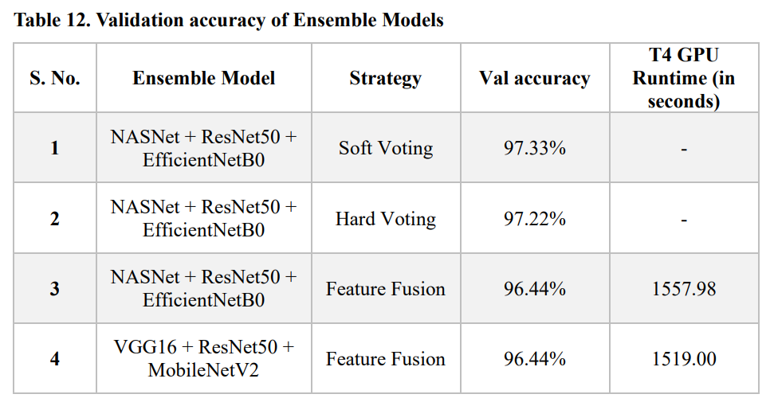

# 🍏 Guava Quality Prediction Web App

A Flask-based deep learning web application that predicts guava quality (**Fresh, Mid, Rotten**) from **images** and **video frames** using CNN models and ensemble learning.

---

## 📌 Abstract
This project leverages **Convolutional Neural Networks (CNNs)** to classify guavas into three categories: *Fresh, Mid-quality, and Rotten*.  
The system integrates **ensemble learning techniques** for improved accuracy and provides a user-friendly **Flask web app** for real-time prediction.  
It aims to assist farmers, vendors, and industries in automating fruit quality assessment, ensuring better pricing, reduced waste, and increased efficiency.

---

## 🎯 Objectives
- Automate guava quality classification from images and video frames.
- Train and compare multiple deep learning models (VGG16, MobileNet, custom CNN).
- Apply **ensemble learning (hard and soft voting)** to enhance performance.
- Deploy a lightweight **Flask web app** with real-time prediction.

---

## 🔬 Methodology

### Research Design


- Data collection and preprocessing (image frames of guava samples).
- Model training on CPU and GPU with transfer learning.
- Evaluation using accuracy, precision, recall, and F1-score.
- Web app deployment for real-time use.

### Ensemble Learning Techniques


- **Hard Voting**: Majority class prediction.  
- **Soft Voting**: Weighted probability-based prediction.  
- Ensemble models outperformed individual CNNs in accuracy and generalization.

### System Architecture


### Workflow


---

## 📊 Results & Analysis

### Validation Accuracy
- **Models trained on CPU**  
  

- **Models trained on GPU**  
  

- **Ensemble Models**  
  

Ensemble models achieved the **highest accuracy** compared to individual models, demonstrating the effectiveness of combining multiple CNN architectures.

---

## 🌐 Web App Screenshots

- **Home Page**  
  

- **About Page**  
  

- **Contact Page**  
  

- **Result Page (1)**  
  

- **Result Page (2)**  
  

- **Frames Analysis**  
  

---

## ⚙️ Tech Stack
- **Deep Learning**: TensorFlow / Keras, CNN, VGG16, MobileNetV2  
- **Programming**: Python  
- **Framework**: Flask  
- **Visualization**: Matplotlib, Seaborn  
- **Tools**: Jupyter Notebook, Google Colab  
- **Deployment**: Flask-based local hosting (future scope: cloud deployment)

---

## 📦 Installation & Usage

```bash
# Clone repository
git clone https://github.com/RaviKrRaushan/guava-quality-prediction.git
cd guava-quality-prediction

# Create virtual environment
python -m venv venv
source venv/bin/activate   # On Windows: venv\Scripts\activate

# Install dependencies
pip install -r requirements.txt

# Run Flask app
python app.py
